

  <h1>💻 TechControl</h1>
  <h3>Sistema Integral de Gestión y Control de Activos IT</h3>

  

    Una solución web de última generación diseñada para centralizar, auditar y optimizar el ciclo de vida de la infraestructura tecnológica empresarial.
  

  

    
    
    
    
    
  

---

## 🌟 Visión General

**TechControl** es una plataforma avanzada de gestión IT que simplifica la administración operativa y la toma de decisiones estratégicas. Permite a los equipos de infraestructura y soporte técnico llevar un control riguroso sobre equipos informáticos, consumibles de impresión, dispositivos de cartelería digital, registros de guardias y presupuestos de compras desde una interfaz unificada, intuitiva y de alto rendimiento.

---

## ✨ Módulos Principales

| Módulo | Descripción |
| :--- | :--- |
| 📊 **Dashboard Ejecutivo** | Métricas e indicadores clave en tiempo real sobre el estado de stock, alertas operativas y consumibles en nivel crítico. |
| 💻 **Equipamiento IT** | Registro detallado de notebooks y estaciones de trabajo, seguimiento de asignaciones, estado funcional y trazabilidad por usuario. |
| 🖨️ **Centro de Impresión** | Monitoreo proactivo de niveles de tóner, unidades de imagen y alertas automáticas de mantenimiento por sucursal. |
| 📺 **DataliveTV (Cartelería Digital)** | Módulo para la organización de credenciales, IDs de dispositivos y accesos universales para pantallas corporativas. |
| 🛡️ **Guardias IT & Tareas Especiales** | Registro operacional de turnos de guardia, tareas extraordinarias, coberturas y cronogramas del personal técnico. |
| 🛒 **Gestión de Pedidos & Compras** | Workflow para la generación, seguimiento y priorización de solicitudes de compra de hardware y suministros. |
| 📈 **Histórico & Auditoría** | Trazabilidad completa de ingresos, egresos y movimientos de activos con reportes exportables para control interno. |

---

## 🎨 Arquitectura Visual & Experiencia de Usuario

TechControl se destaca por un diseño de interfaz nítido y moderno enfocado en la usabilidad profesional:

- 💎 **Diseño Neomórfico & Glassmorphism**: Acabados visuales elegantes con jerarquía cromática optimizada mediante el espacio de color **OKLCH**.
- 🌓 **Soporte Tema Claro / Oscuro**: Adaptación dinámica para maximizar el confort visual en extensas jornadas de trabajo.
- ⚡ **Respuesta Instantánea**: Interacciones fluidas impulsadas por componentes Radix UI accesibles y animaciones optimizadas.

---

## 🖼️ Galería de la Interfaz

  <table>
    <tr>
      <td width="50%" align="center">
        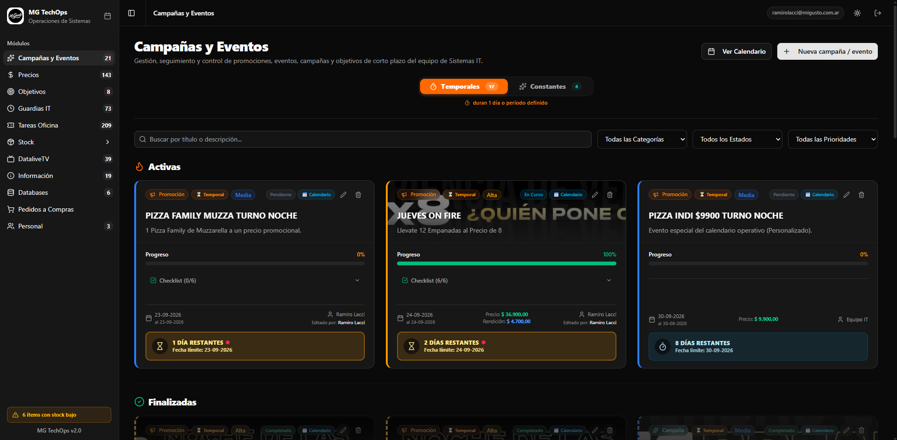
         
        <b>01. Dashboard Principal & Métricas Generales</b>
      </td>
      <td width="50%" align="center">
        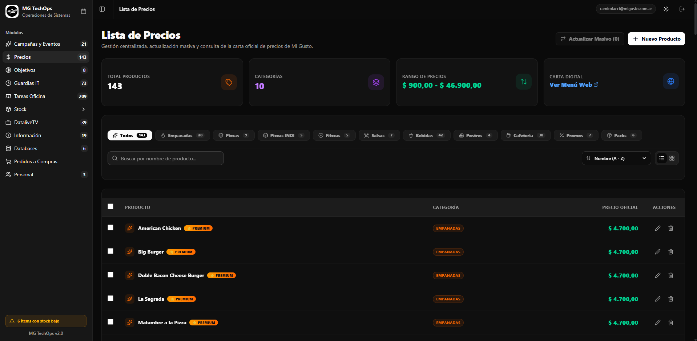
         
        <b>02. Control de Inventario de Notebooks & PCs</b>
      </td>
    </tr>
    <tr>
      <td width="50%" align="center">
        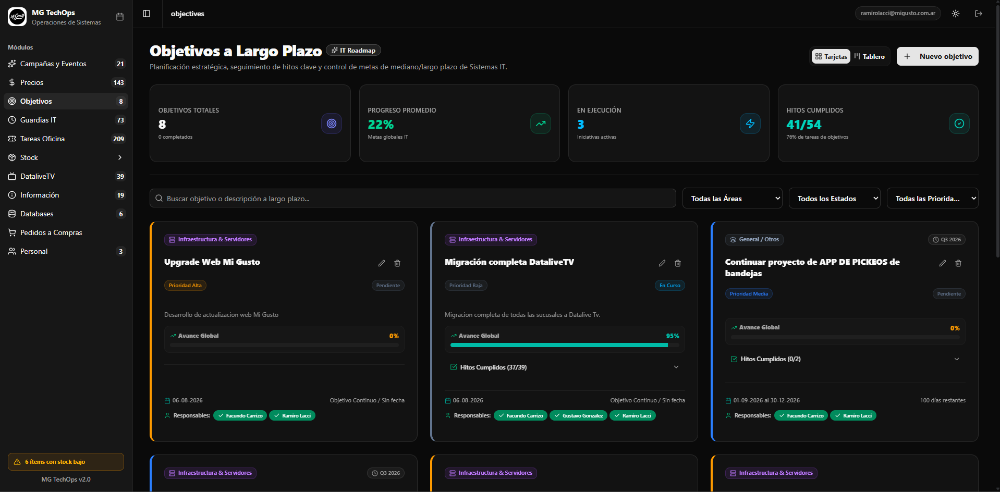
         
        <b>03. Monitoreo de Impresoras & Tóner</b>
      </td>
      <td width="50%" align="center">
        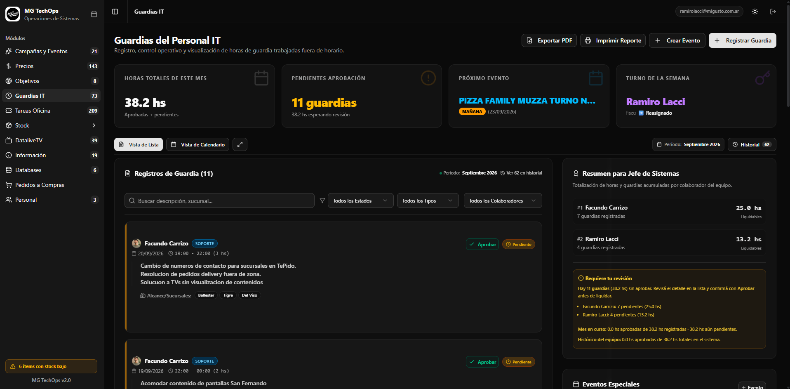
         
        <b>04. Módulo de Cartelería Digital (DataliveTV)</b>
      </td>
    </tr>
    <tr>
      <td width="50%" align="center">
        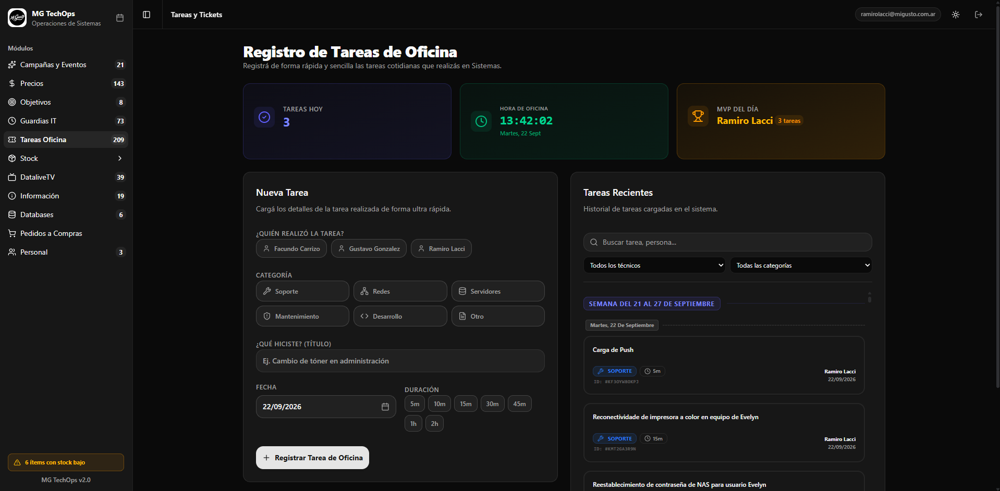
         
        <b>05. Gestión & Seguimiento de Solicitudes de Compra</b>
      </td>
      <td width="50%" align="center">
        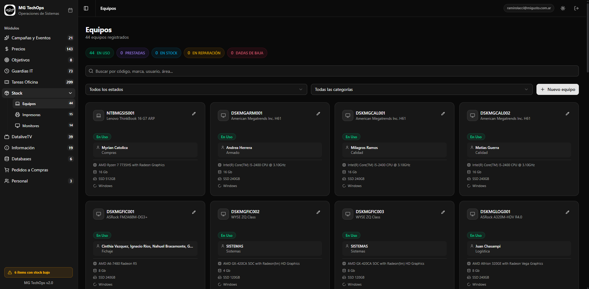
         
        <b>06. Auditoría & Registro de Movimientos</b>
      </td>
    </tr>
    <tr>
      <td width="50%" align="center">
        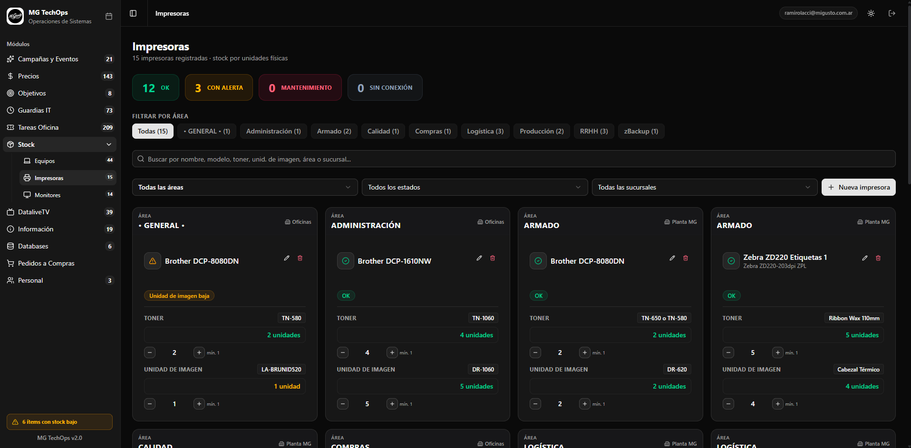
         
        <b>07. Administración de Personal & Asignaciones</b>
      </td>
      <td width="50%" align="center">
        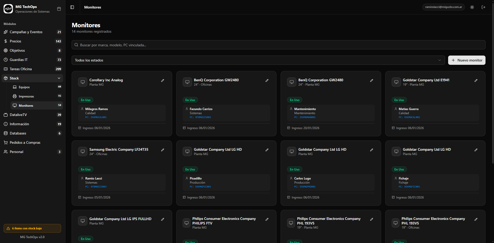
         
        <b>08. Programación & Registro de Guardias IT</b>
      </td>
    </tr>
    <tr>
      <td width="50%" align="center">
        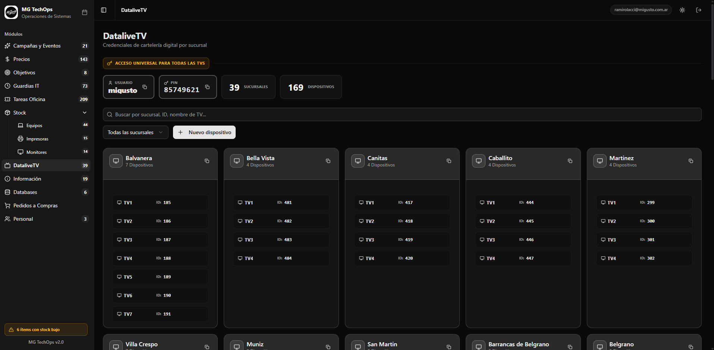
         
        <b>09. Control de Tareas Especiales & Mantenimiento</b>
      </td>
      <td width="50%" align="center">
        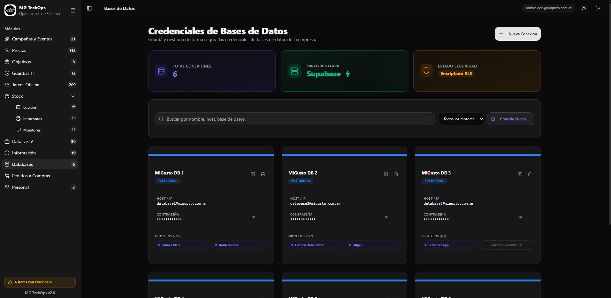
         
        <b>10. Cotizaciones & Lista de Precios IT</b>
      </td>
    </tr>
    <tr>
      <td width="50%" align="center">
        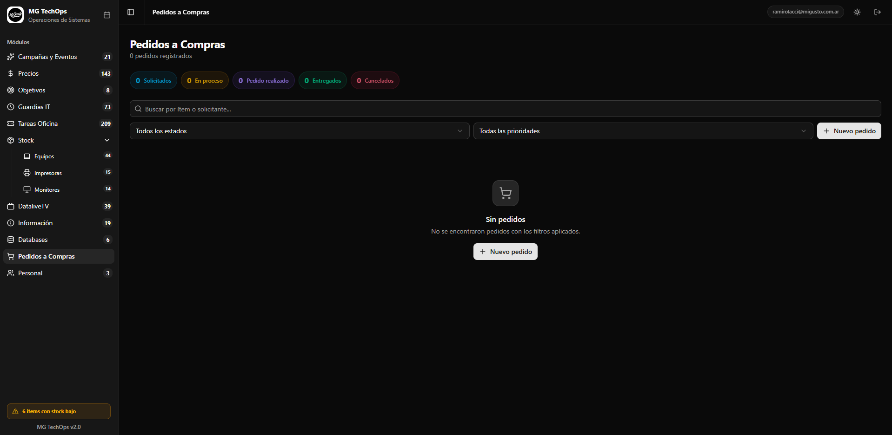
         
        <b>11. Catálogo de Productos & Base de Datos</b>
      </td>
      <td width="50%" align="center">
        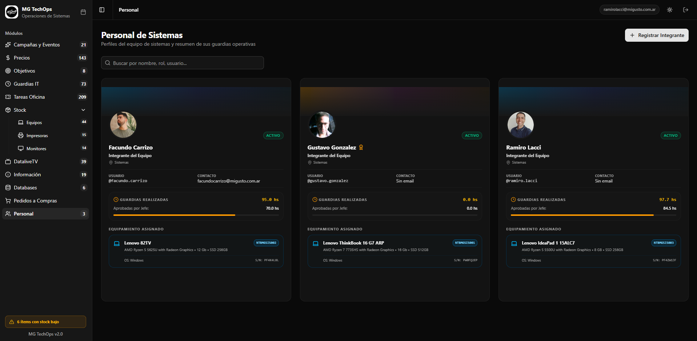
         
        <b>12. Módulo de Reportes & Exportación</b>
      </td>
    </tr>
  </table>

---

  © 2026 TechControl IT Solutions. Todos los derechos reservados.

